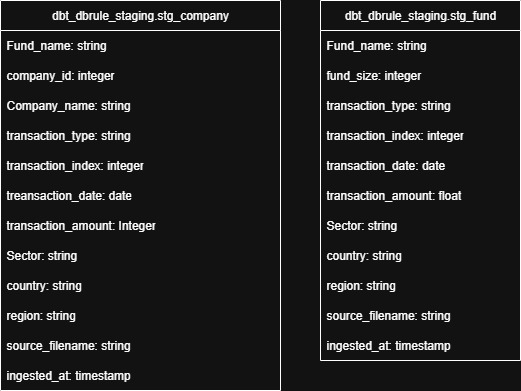

# dbt Project

This repository implements a dbt data pipeline for transforming fund and company transaction data into a dimensional model
that supports accurate reporting and NAV (Net Asset Value) calculations.

The project runs on dbt Cloud + BigQuery and uses dbt_external_tables for ingesting source files (CSV extracts from Excel stored in GCS).

## Project structure

* models/
	* raw_ext/               # External sources (dbt_external_tables)
	* stage/                 # Staging layer: cleaning, typing, normalization
	* intermediate/          # Deduplication, dimensional and fact models
	* marts/                 # Business-facing marts (NAV calculations)
* seeds/
	* country_map.csv        # Reference data for country standardization
* tests/                     # Reusable SQL macros
	* generic/one_to_one.sql # test if any A maps to > 1 B, or any B maps to > 1 A
* macros/                    # Reusable SQL macros
	* normalise_country.csv  # Reference data for country standardization
*dbt_project.yml            # Project configuration
* README.md                  # This file

## Data Modeling Approach

We implemented a layered dbt architecture:

### 0. raw_ext 

raw_ext exposes the Excel extracts (saved as CSVs in GCS) to BigQuery as external tables. We don’t transform here—just register files so downstream staging (stg_*) can clean, type, and standardize.

**Schema: raw_ext**

### 1. Staging 

* One model per raw source table (stg_fund, stg_company).
* Tasks:
    * Column cleanup (trim, safe_cast, nullif, initcap).
    * Standardize country/region using seeds/country_map.csv.
    * Add ingestion timestamp.
    * add ingestion source 
    * Add ingestion timestamp.

**Schema: dbt_dbrule_staging**

## 2. Intermediate
* Dimensional models:
    * dim_fund (fund-level attributes, including fund_size).
    * dim_company (company-level attributes).

* Fact models:
    * fct_fund_event (all fund transactions).
    * fct_company_valuation (company valuations linked to funds).

* Bridge model: 
    * bridge_fund_company

* Deduplication applied using row_number() over (...) to keep the latest transaction_index per grain.

**Schema: dbt_dbrule_intermediate**

## 3. Marts 

* Q2.1 Fund NAV: Calculate NAV per fund/date as:
    * NAV = latest valuation + flows (calls/distributions) since valuation

* Q2.2 Company NAV (ownership scaling):
    * Ownership % = cumulative commitments / fund_size
    * Company NAV = ownership % * company valuation

* Q2.3 Company NAV (scaled to fund NAV):
    * Ownership % = Fund NAV / Sum(company valuations for fund/date)
    * Company NAV = Ownership % * company valuation

Forward-filled daily NAV model (fund_nav_daily) for continuous reporting.

## Testing & Data Quality

Implemented using schema.yml + dbt_utils:

Column-level tests
* Not null: fund_name, company_id, transaction_date, transaction_type, transaction_amount.
* Accepted values: transaction_type (Valuation, Commitment, Distribution, Call).
* Expression tests:
    * Fund transaction_amount must be > 0, except Distributions, which must be < 0.
    * Company transaction_amount must always be > 0.

* Dates: transaction_date >= '2020-01-01'.

Uniqueness / integrity
* company_id ↔ company_name one-to-one.
* dim_fund.fund_name unique.
* Relationships:Facts → dimensions (fund_sk, company_id must exist in dim tables).

Seeds
* country_map.csv provides a mapping table to normalize raw country names.

## Pipelines & Execution

1.External ingestion
    * Source CSVs land in GCS (gs://.../fund_data.csv, company_data.csv).
    * Exposed to BigQuery via dbt_external_tables.

2. dbt job (production):
    * Step 1: dbt deps
    * Step 2: dbt seed (load country_map)
    * Step 3: dbt run --select stage
    * Step 4: dbt run --select intermediate
    * Step 5: dbt build --select marts
    * Step 6: dbt test

3. Docs & Catalog
    * dbt Cloud generates docs after production job run.
    * Browse column-level metadata, lineage, and freshness.

## Assumptions
* All currency amounts are in the same currency (no FX adjustments).
* Fund size is taken as the latest snapshot from dim_fund.
* NAV calcs assume correct transaction signs (Calls/Commitments positive, Distributions negative).
* For company NAV, only commitments are used for ownership calculation.
